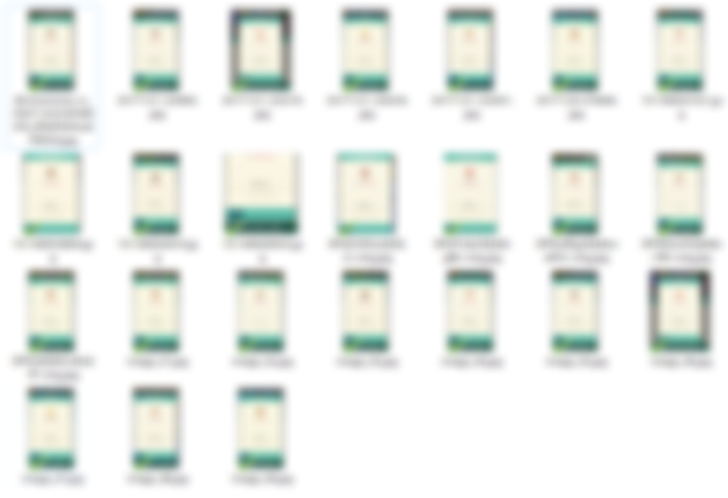
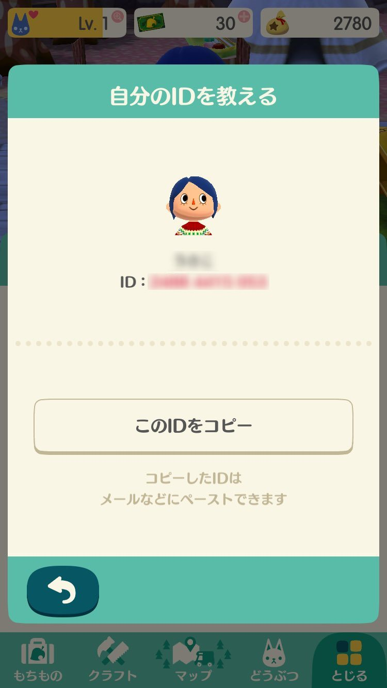

[](https://circleci.com/gh/corselia/crop-pokemori-prof-image/tree/master)

# Overview
- you can crop the profile image of [`Doubutsu-No-Mori Pocket Camp` (Animal Crossing Pocket Camp)](https://ac-pocketcamp.com/)
    - first step
        - you prepare the profile image file(s) of `Doubutsu-No-Mori Pocket Camp` (Animal Crossing Pocket Camp)
    - second step
        - exec method in this gem
    - third step
        - you get the devided image files, be happy :)

# Installation
```ruby
$ gem install crop_pokemori_prof_image
```

# Required
- you must install `imagemagick` and `libmagickwand-dev` (for Ubuntu) to use `rmagick` gem
    - please investigate if you use CentOS or so forth

# Usage

#### 1. prepare the image file(s)
- prepare the profile image file(s) of `Doubutsu-No-Mori Pocket Camp` (Animal Crossing Pocket Camp) like below



#### 2. require gem
```ruby
require 'crop_pokemori_prof_image'
```

#### 3. exec method
- these are class method of `CropPokemoriProfImage` class

##### 3-1. `crop_single_image` method
- `crop_single_image` method is for only one image file
- `crop_single_image` method takes two arguments
    - the first argument
        - the image file name
    - the second argument
        - the output directory name
        - optional
        - the default value is 'crop_image'

##### 3-2. `crop_multiple_image` method
- `crop_multiple_image` method is for multiple image files
- `crop_multiple_image` method takes two arguments
    - the first argument
        - the directory name which contains the image files
        - optional
        - the default value is '.'
    - the second argument
        - the output directory name
        - optional
        - the default value is 'crop_image'

#### 4. 🎉you can get the crop image files🎉
- after exec method, you can get the crop image files
- you can get four part files per one source file
    - 1. face
        - naming format is `SOURCE_FILENAME_WITHOUT_EXT`_face.`EXT`
    - 2. name
        - naming format is `SOURCE_FILENAME_WITHOUT_EXT`_name.`EXT`
    - 3. id number without 'ID' notation
        - naming format is `SOURCE_FILENAME_WITHOUT_EXT`_id_number.`EXT`
    - 4. id number with 'ID' notation
        - naming format is `SOURCE_FILENAME_WITHOUT_EXT`_whole_id_part.`EXT`

# Example

#### example code
```ruby
require 'crop_pokemori_prof_image'

CropPokemoriProfImage.crop_single_image('sample.jpg')
```

#### when the source file is `sample.jpg`
- `sample.jpg` is below



#### the output four files are below
- note: the image with Gaussian blur for privacy

##### face (sample_face.jpg)


##### name (sample_name.jpg)


##### id number without 'ID' notation (sample_id_number.jpg)


##### id number with 'ID' notation (sample_whole_id_part.jpg)


## Development

After checking out the repo, run `bin/setup` to install dependencies. Then, run `rake spec` to run the tests. You can also run `bin/console` for an interactive prompt that will allow you to experiment.

To install this gem onto your local machine, run `bundle exec rake install`. To release a new version, update the version number in `version.rb`, and then run `bundle exec rake release`, which will create a git tag for the version, push git commits and tags, and push the `.gem` file to [rubygems.org](https://rubygems.org).

## Contributing

Bug reports and pull requests are welcome on GitHub at https://github.com/corselia/crop-pokemori-prof-image.

## License

The gem is available as open source under the terms of the [MIT License](https://opensource.org/licenses/MIT).

## TOO BAD! BAD! BAD!
- Test codes aren't written!
- if the source file's resolution isn't 16 vs 9, this app doesn't work correctly...
    - for instance, iOS resolution
    - for instance, pre-crop the image file by player
